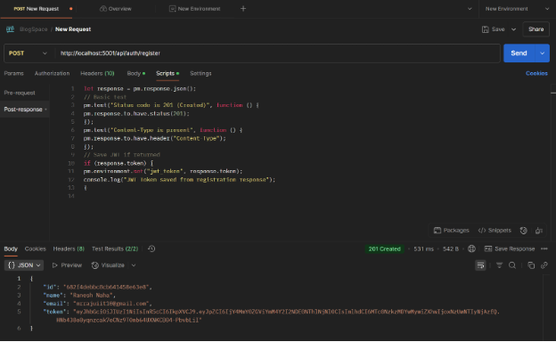

# TaskManager v0.3

A full-stack blog web application that allows users to create, read, update, and delete blog posts. It provides a user-friendly interface for bloggers to share their thoughts and manage their content.

## Features

* User Authentication (Signup, Login, Logout)
* Profile Management
* Blog Management:
  * Create new blogs
  * View all blogs
  * Update existing blogs
  * Delete blogs

## API Documentation

### Authentication

User authentication is handled via POST requests:

### Blog Operations

#### Retrieving Blogs

Get all blogs:

Get user-specific blogs:

#### Creating and Updating Blogs

Post functionality:

Update functionality:

## API Summary

